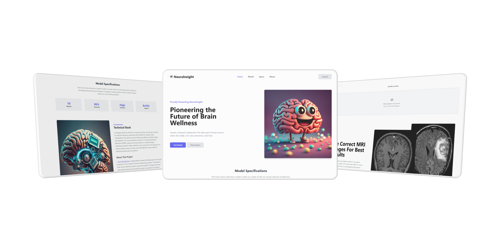

<div align="center">



# `Neuralnsight`


<br />


[](https://opensource.org/licenses/MIT)

<p class="align center">
<h4><code>Neuralnsight</code> is an open-source neural network classifier for recognizing brain tumors
in magnetic resonance imaging scans.</h4>
</p>

[Installation](#installation) •
[Presenation](src/docs/project-presentation.pdf) •
[Project Report](src/docs/project-report.pdf) •
[Interview/Viva Q&A](src/docs/viva-questions.md) •
[License](LICENSE) •
[Contributing](#contributing) •
[Acknowledgments](#acknowledgments) •
[Follow]("https://github.com/iamDyeus") 

</div>

# Problem Statement
One of the most crucial tasks of neurologists and radiologists is early brain tumor detection. 
However, manually detecting and segmenting brain tumors from 
Magnetic Resonance Imaging (MRI) scans is challenging, and prone to errors. 
That is why there is a need of an automated brain tumor detection system for early diagnosis of the disease.

# Getting Started 
Below are the Instructions on setting up the project Locally. This Project uses the concept of Virtual Environments in Python so if you don't know how they work then refer to this [docs.python.org](https://docs.python.org/3/tutorial/venv.html)

## Prequisites
- Operating System - Windows (Didn't tested others)
- Python (v3.11.0 Tested)
- pip3 (usually gets installed with python)

if all the above prequisities are Satisfied, you may proceedto the next section.

## Installation
Follow these instructions to Setup your Own instance of the Application :

### 1: Clone the Repository

You can clone or download this repository using the following methods:

#### GitHub CLI

```sh
gh repo clone iamDyeus/Neuralnsight
```

#### Git

```sh
git clone https://github.com/iamDyeus/Neuralnsight.git
```

### 2: Cd to the folder
Open terminal/cmd/powershell and change directory/folder to the cloned folder.
```sh
cd Neuralnsight
```

### 3 : Create & Activate a Python Virtual Environment
After step 2, ensure you see the following cmd/terminal prompt

```sh
Something.../Neuralnsight>
```

After this, run the following command in cmd/terminal:
```sh
python -m venv .env
```

once your Virtual Environment is Created, Activate it using the following command in cmd/terminal:
```sh
.env/Scripts/activate.bat
```

### 4 : Install the PIP packages/dependencies
Once your Virtual Environment is setup, your Terminal should look like this :
```sh
  (.env) Something...\Neuralnsight>
```
otherwise follow the previous step again.

After this, run the following command in cmd/terminal:

```sh
pip install -r requirements.txt
```

</br>

### 5 : It's done 🎉 | Run the app
Open Root folder with cmd/terminal and activate Virtual Environment in it, now open `app.py` using python 3.
your terminal should look something like this :
```bash
  (.env) Something...\Neuralnsight>python "src/app.py"
```
</br>
And Congrats 🎉 the Flask Application would start if you have followed each step correctly, now just open the local host link you'll get in the output terminal.

</br></br>

# Contributing

Contributions are what make the open source community such an amazing place to learn, inspire, and create. Any contributions you make are **greatly appreciated**.

If you have a suggestion that would make this better, please fork the repo and create a pull request. You can also simply open an issue with the tag "enhancement".
Don't forget to give the project a star! Thanks again!

1. Fork the Project
2. Create your Feature Branch (`git checkout -b feature/AmazingFeature`)
3. Commit your Changes (`git commit -m 'Add some AmazingFeature'`)
4. Push to the Branch (`git push origin feature/AmazingFeature`)
5. Open a Pull Request


# License
Distributed under the MIT License . See [`LICENSE`](LICENSE) for more information.


# Acknowledgments
- Readme Design Inspired from [`danielmiessler`](https://github.com/danielmiessler/fabric)
- Model trained by Tutorial from [`Knowledge Doctor`](https://www.youtube.com/watch?v=pp61TbhJOTg&pp=ygUma25vd2xlZGdlIGRvY3RvciBicmFpbiB0dW1vciBkZXRlY3Rpb24%3D)
- UI Components from [`tailblocks.cc`](https://tailblocks.cc)


## Star History
[](https://star-history.com/#iamDyeus/Neuralnsight&Date)

